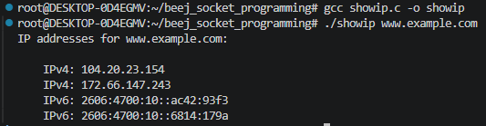

# Chapter 5 - System Calls or Bust

## Summary
Calls learned: `getaddrinfo()`, `socket()`, `connect()` `bind()`, `listen()`, `accept()`, `send()`, `recv()`, `sendto()`, `recvto()`, `close()`, `shutdown()`, `getpeername()`, `gethostname()`

Implementations over [showip.c](src/showip.c) and [listen.c](src/listen.c)

## `getaddrinfo()` - Prepare to launch!

Implementation over [showip.c](src/showip.c)



## `socket()` - Get the File Descriptor

```c
#include <sys/types.h>
#include <sys/socket.h>

int socket(int domain, int type, int protocol);
```

domain: `PF_INET`, `PF_INET6`

type: `SOCK_STREAM`, `SOCK_DGRAM`

protocol: can be set to 0 for the given `type` or call `getprotobyname()` to look up the protocol you can, "tcp" or "udp"

How to use the values after calling `getaddrinfo()` and feed into `socket()`:

```c
int s
struct addrinfo hints, *res;

getaddrinfo("www.example.com", "http", &hints, &res);

s = socket(res->ai_family, res->ai_socktype, res->ai_protocol);
```

`socket()` returns a socket descriptor, or -1 on error

## `binđ()` - What port am I on?

```c
#include <sys/types.h>
#include <sys/socket.h>

int bind(int sockfd, struct sockaddr *my_addr, int addrlen);
```

Assigns with the socket definition to the port

## `connect()` - Hey, you!

```c
#include <sys/types.h>
#include <sys/socket.h>

int connect(int sockfd, struct sockaddr *serv_addr, int addrlen);
```

Also, notice that we didn’t call `bind()`. Basically, we don’t care about our local port number; we only care where we’re going (the remote port). The kernel will choose a local port for us, and the site we connect to will automatically get this information from us. No worries

## `listen()` - Will somebody please call me?

```c
int listen(int sockfd, int backlog);
```

`sockfd` is the usual socket file descriptor from the `socket()` system call. `backlog` is the number of connections allowed on the incoming queue. What does that mean? Well, incoming connections are going to wait in this queue until you `accept()` them (see below) and this is the limit on how many can queue up. Most systems silently limit this number to about 20; you can probably get away with setting it to 5
or 10 .

Well, as you can probably imagine, we need to call bind() before we call listen() so that the server is running on a specific port. (You have to be able to tell your buddies which port to connect to!)

Order of exection:

```c
getaddrinfo();
socket();
bind();
listen();
```

## `accept()` - Thank you for calling port 3490

After a remote machine `connect()`s on a port that you are `listen()`ing on, you `accept()` to get the pending connection, and you receive another socket descriptor. The original is stll listening more new connections, while the new one will be used for `send()` and `recv()`

```c
#include <sys/types.h>
#include <sys/socket.h>

int accept(int sockfd, struct sockaddr *addr, socklen_t *addrlen);
```

## `send()` and `recv()` - Talk to me, baby!

Communication for stream sockets!

These are blocking calls:
- `recv()` will block until there is some data ready to receive. 
- `send()` can also block if the stuff you're sending is jammed up

```c
int send(int sockfd, const void *msg, int len, int flags);
```

Example:

```c
char *msg = "Beej was here!";
int len, bytes_sent;

len = strlen(msg);
bytes_sent = send(sockfd, msg, len, 0);
```

`send()` returns the the number of bytes actually sent out (so this might be less than `len`). If the value returned doesn't match `len`, it's up to you to send the rest of the string. Good news - small packets (less than 1K) should be ok to send in one go.

```c
int recv(int sockfd, void *buf, int len, int flags);
```

`buf` is the buffer to read the information into and `len` is the maximum buffer length.

## `sendto()` and `recvfrom()` - Talk to me, DGRAM-style

Since datagram sockets aren’t connected to a remote host, guess which piece of information we need to give before we send a packet? That’s right! The destination address! Here’s the scoop:

```c
int sendto(int sockfd, const void *msg, int len, unsigned int flags, 
    const struct sockaddr *to, socklen_t tolen);
```

`to` is a pointer to a `struct sockaddr` (`struct sockaddr_in` or `struct_sockaddr_in6` or `struct sockaddr_storage`), `tolen`, basically an `int`, can simply be `sizeof *to` or `sizeof(struct sockaddr_storage)`

To get your hands on the destination address structure, you’ll probably either get it from `getaddrinfo()`, or from `recvfrom()`

```c
int recvfrom(int sockfd, void *buf, int len, unsigned int flags,
    struct sockaddr *from, int *fromlen);
```

`from` and `fromlen` are initialized like in `sendto()`. When the function returns, `fromlen` will contain the length of the address actually stored in `from`

If you `connect()` a datagram socket, you can simply use `send()` and `recv()` for all transactions. 

## `close()` and `shutdown()` - Get outta my face!

Regular Unix file descriptor `close()` function:

```c
close(sockfd);
```

With flags:

```c
int shutdown(int sockfd, int how);
```

how | Effect
--- | ---
0   | Further receives are disallowed
1   | Further sends are disallowed
2   | Further sends and receives are disallowed (like `close()`)

If you deign to use `shutdown()` on unconnected datagram sockets, it will simply make the socket unavailable for further `send()` and `recv()` calls (remember that you can use these if you `connect()` your datagram socket).

It’s important to note that `shutdown()` doesn’t actually close the file descriptor—it just changes its usability. To free a socket descriptor, you need to use `close()`.

## `getpeername()` - Who are you?

The function `getpeername()` will tell you who is at the other end of a connected stream socket

```c
#include <sys/socket.h>

int getpeername(int sockfd, struct sockaddr *addr, int *addrlen);
```

`sockfd` is the descriptor of the connected stream socket, addr is a pointer to a `struct sockaddr` (or a struct `sockaddr_in`) that will hold the information about the other side of the connection, and `addrlen` is a pointer to an int , that should be initialized to `sizeof *addr` or `sizeof(struct sockaddr)`

## `gethostname()` - Who am I?

It returns the name of the computer that your program is running on. The name can then be used by `getaddrinfo()`, above, to determine the IP address of your local machine.

```c
#include <unistd.h>

int gethostname(char *hostname, size_t size);
```

