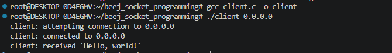
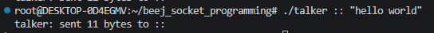
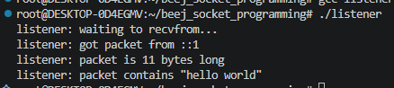

# Chapter 6 - Client-Server Background

## A Simple Stream Server

Implementation in [server.c](src/server.c), tested using `telnet 0.0.0.0 3490`

## A Simple Stream Client

Implementation in [client.c](src/client.c), calling the server in `server.c` with `./client 0.0.0.0`

## Datagram Sockets

Implementation in [talker.c](src/talker.c) and [listener.c](src/listener.c)

Let `listener.c` hang with `./listener` and then call `./talker :: "hello world"` for the listene to receive

