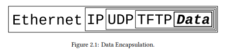

# Chapter 2 - What is a socket?

## Summary

A socket is a way to speak to other programs using the standard Unix file descriptors. There are all kinds of descriptors but we will focus on Internet Sockets. 

Two type of sockets include the Stream Socket and the Datagram Socket.
The Stream Socket sends information in order and error-free using TCP. The Datagram Socket sends packets out of order, each packet being error-free. SOCK_DGRAM is used when TCP is unavailable or when few dropped packets are fine. Some file transfer applications use the three-way handshake to request missing packets. For unreliable applications like games, videos, audio, using UDP for some dropped packets are fine to trade for speed. For chat messages, TCP is used.

When a packet is born, it is encapsulated by various headers. When it is received, it must strip the headers to reveal the data - Data encapsulation. The Layered Network Model (OSI) describes a system of network functionality - application, presentation, session, transport, network, data link, physical. For UNIX, it is closer to "application, transport, network, physical". 

## Intro

A way to speak to other programs using standard Unix file descriptors

When Unix programs do any sort of I/O, they do it by reading
or writing to a file descriptor (an integer associated with an open file).

File = network connection, FIFO, pipe, terminal real on-the-disk file, etc. -> Everything in Unix is a file!

How to get the file descriptor for network communication: call `socket()` system routine -> returns socket descriptor -> communicate using `send()` and `recv()` (`man send`, `mand recv`)

Why can't I just use `read()` and `write()`? You can, but socket calls offer more control over transmission

All kinds of sockets: DARPA (Internet sockets), path names on a local node (Unix sockets), CCITT X.25 addresses, etc.

Book deals with Internet Sockets only.

## Two types of Internet Sockets

Look up Raw Sockets - very powerful, but not mentioned in the book.

Two types: Stream Sockets (`SOCK_STREAM`), Datagram Sockets (`SOCK_DGRAM`, sometimes called "connectionless sockets")

Stream sockets are reliable two-way connected communication streams. If you output two items into the socket in the order “1, 2”, they will arrive in the order “1, 2” at the opposite end. They will also be error-free.

What use stream sockets? `telnet` or `ssh` applications, characters typed to arrive in the same order, browsers using HTTP.

How do stream sockets achieve this high level of data transmission quality? They use TCP (The Transmission Control Protocol, RFC 793). Part of "TCP/IP", where IP stands for "Internet Protocol". IP deals primarily with Internet routing and is not generally responsible for data integrity.

Why are Datagram sockets connectionless? Unreliable?

If you send a datagram, it may arrive. It may arrive out of order. If it arrives, the data within the packet will be error-free.

Datagram sockets also use IP or routing, but not with TCP, but with UDP (User Datagram Protocol).

Connectionless? Because you don't have to maintain an open connection like stream sockets - build a packet, slap an IP heade with destination, send out, no connection needed. Used when TCP is unavailable or few dropped packets are fine. Examples: `tftp`, `dhcpcd`, games, audio, video, etc.

`tftp` and `dhcpcd` transfers binary applications and cannot be lost, why UDP? They have their own protocol on top of UDP - Three-way handshake, sends ACK after each packet received, resends if sender does not receive an ACK, repeat until every packet is sent.

For unreliable applications like games, audio, video, you can ignore dropped packets or compensate (lag in games)

Why UDP? Speed. Chat messages should use TCP, rapid positional updates in games use UDP since 1-2 lost updates is fine.

## Low level Nonsense and Network Theory - Data Encapsulation

a packet is born, the packet is wrapped (“encapsulated”) in a header (and rarely a footer) by the first protocol (say, the TFTP protocol), then the whole thing (TFTP header included) is encapsulated again by the next protocol (say, UDP), then again by the next (IP), then again by the final protocol on the hardware (physical) layer (say, Ethernet).

When another computer receives the packet, the hardware strips the Ethernet header, the kernel strips the IP and UDP headers, the TFTP program strips the TFTP header, and it finally has the data.

The infamous Layered Network Model (aka “ISO/OSI”):
- Application (user interaction)
- Presentation
- Session
- Transport
- Network
- Data Link
- Physical (hardware, serial, Ethernet)

A layered model more consitent with Unix:
- Application Layer (telnet, ftp, etc.)
- Host-to-Host Transport Layer (TCP, UDP)
- Internet Layer (IP and routing)
- Network Access Layer (Ethernet, wi-fi, etc)

-> encapsulation!

All you have to do for stream sockets is `send()` the data out. All you have to do for datagram sockets is encapsulate the packet in the method of your choosing and `sendto()` it out. The kernel builds the Transport Layer and Internet Layer on for you and the hardware does the Network Access Layer.

The router strips the packet to the IP header, consults its routing table. (Reference [IP RFC](https://datatracker.ietf.org/doc/html/rfc791) for more)
